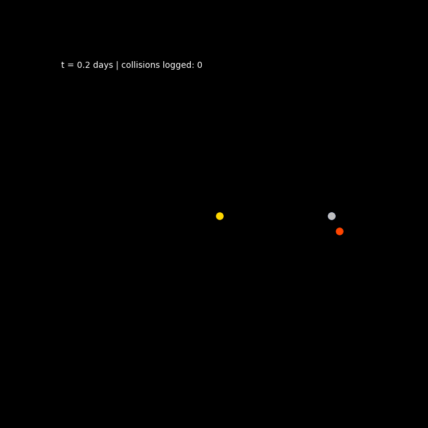

# N-Body Orbital Mechanics Simulator

**[Try the live demo →](./demo/index.html)** (open in a browser locally, or enable GitHub Pages on this repo — no install needed. Click to drop a body — it gets an automatic orbital nudge so it doesn't fall straight in. Drag to launch it with a specific velocity, shown as a live arrow. Adjust body size with the slider. White lines show each body's current direction of travel. Close encounters spiral together for a few orbits before merging, momentum-conserving, rather than colliding in a straight line or flying apart.)



A from-scratch gravitational N-body simulator written in Python, with
real-time collision avoidance between bodies. Built without tutorials or a
structured curriculum — the physics, integrator, and avoidance logic were
worked out and debugged from first principles.

## What it does

- Simulates gravitational attraction between an arbitrary number of bodies
  using full pairwise force summation (every body pulls on every other body).
- Uses a **velocity-Verlet (leapfrog) integrator** instead of naive Euler
  integration, because Euler integration leaks energy over long runs and
  orbits visibly decay or blow up. Velocity-Verlet keeps total system energy
  essentially flat (see `tests/test_physics.py`).
- **Collision avoidance**: before bodies get close enough to physically
  collide, the simulator detects the closing trajectory and applies a small
  corrective delta-v along the line connecting the two bodies, deflecting
  them around each other instead of letting them pass through / merge.
  This is a simplified version of the kind of proximity-avoidance logic
  used in real orbital collision-avoidance maneuvers.
- Logs every close-approach / collision event with a timestamp and distance.

## Why velocity-Verlet

For an inverse-square force law, symplectic integrators (Verlet family)
conserve a shadow Hamiltonian close to the true energy, so long-run orbital
simulations don't secularly drift. Standard RK4 or Euler will drift given
enough steps. This matters here because the simulator is meant to run for
many thousands of timesteps.

## Usage

```bash
pip install -r requirements.txt

# Run a 30-day demo simulation and print energy conservation diagnostics
python nbody_sim.py

# Watch a live animated 2D projection of the same system
python visualize.py
```

### Building your own system

```python
from nbody_sim import Body, NBodySimulator

sun = Body("Sun", mass=1.989e30, position=[0,0,0], velocity=[0,0,0], radius=6.96e8)
planet = Body("Planet", mass=5.97e24, position=[1.5e11,0,0], velocity=[0,29780,0], radius=6.4e6)

sim = NBodySimulator([sun, planet], dt=3600)
sim.run(24 * 365)  # one year at 1-hour steps
print(sim.total_energy())
```

## Tests

```bash
python -m pytest tests/ -v
```

Verifies:
1. Total mechanical energy stays within 1% over a 10-day simulation.
2. Two bodies on a direct collision course never reach exact zero separation
   once collision avoidance is enabled.

## Possible extensions

- Barnes-Hut tree approximation to scale past O(n^2) for large N
- Relativistic (post-Newtonian) correction terms for high-precision orbits
- 3D visualization with `plotly` or `vpython`
