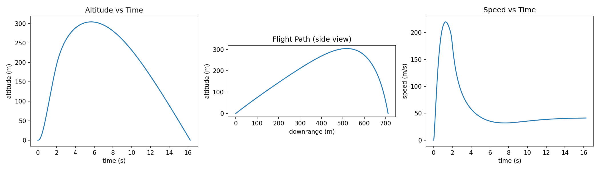

# Rocket Flight Trajectory Simulator

**[Try the live demo →](./demo/index.html)** (drag sliders for launch angle, wind, and fin size — the trajectory redraws live in the browser, no install needed.)



A point-mass (3-DOF) model rocket trajectory simulator, built to explore the
same kind of question tackled with OpenRocket / Ansys STK for the American
Rocketry Challenge: given a motor thrust curve, body-tube diameter, and fin
geometry, what apogee and downrange distance should I expect, and how
sensitive is that to wind?

## What it models

- **Atmosphere**: an ISA (International Standard Atmosphere) density model
  so drag properly weakens as the rocket climbs.
- **Propulsion**: a discretized thrust curve (time, thrust) pairs,
  interpolated at each timestep, with linear propellant mass depletion
  over the burn.
- **Aerodynamics**: quadratic drag using a reference area from body-tube
  diameter and a drag coefficient that scales with fin planform area
  (bigger fins -> more stability margin in real rocketry, but also more
  parasitic drag -- the classic trade-off explored in `configs/fin_variants.py`).
- **Wind**: a base horizontal wind plus Gaussian gust noise, re-sampled at
  every integration step, so a single flight isn't a clean deterministic
  line -- and `monte_carlo_apogee()` runs many flights to build a
  distribution of likely outcomes under gusty conditions.
- **Launch rail constraint**: the rocket doesn't move until thrust exceeds
  weight (otherwise a naive point-mass model has it "falling" through the
  pad before ignition ramps up).

## What it does NOT model (by design)

This is intentionally a lighter-weight point-mass simulator, not a
replacement for OpenRocket's finite-element 6-DOF model:
- No recovery system (parachute/streamer) -- descent is modeled as
  drag-limited free-fall of the body alone.
- No explicit static margin / center-of-pressure calculation -- fin effect
  is approximated only through added parasitic drag, not restoring torque.
- Wind is not altitude-dependent (no wind shear layers).

These are documented as the natural next steps below.

## Usage

```bash
pip install -r requirements.txt

# Single flight, printed summary
python rocket_sim.py

# Altitude / flight-path / speed plots -> flight_profile.png
python plot_flight.py

# Compare apogee across fin geometries (drag vs. stability trade-off)
python configs/fin_variants.py
```

Sample output from `fin_variants.py`:

```
Variant       Fin area (m²)  Mean apogee (m)    Std (m)
small_fins           0.0132            606.8       36.6
baseline             0.0306            358.7       41.3
large_fins           0.0552            224.4       51.0
```

Bigger fins add stability in a real airframe but clearly cost apogee here
purely through drag -- exactly the tension you tune around in OpenRocket.

## Extending this

- Swap the fixed drag-coefficient-vs-fin-area heuristic for a proper
  Barrowman equation center-of-pressure calculation.
- Add a recovery event (parachute deployment at apogee) with a separate,
  much higher drag coefficient for descent.
- Add altitude-dependent wind shear.
- Feed in real OpenRocket `.ork` motor thrust-curve exports directly.
